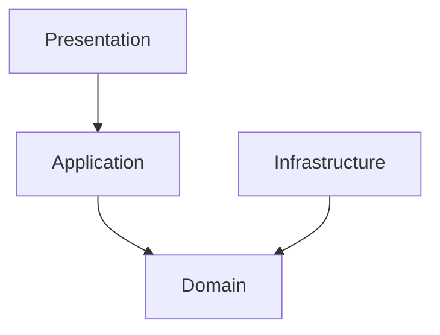

# Issue #26: Documentación del Proyecto

## 📋 Descripción

Crear documentación completa y profesional del proyecto para facilitar el desarrollo, mantenimiento y onboarding de nuevos desarrolladores.

## 🎯 Objetivos

1. **Documentar la arquitectura** y decisiones de diseño
2. **Guiar el desarrollo** con ejemplos prácticos
3. **Facilitar el despliegue** con instrucciones paso a paso
4. **Estandarizar el código** con guías de estilo
5. **Documentar las APIs** y servicios principales

## ✅ Criterios de Aceptación

### README.md Principal

- [ ] Descripción clara del proyecto
- [ ] Badges de estado (CI, versión, licencia)
- [ ] Quick start guide
- [ ] Stack tecnológico
- [ ] Estructura del proyecto
- [ ] Enlaces a documentación adicional

### Documentación de Arquitectura

- [ ] `ARCHITECTURE.md` - Clean Architecture + Atomic Design
- [ ] Diagrama de capas y flujo de dependencias
- [ ] Explicación de cada capa (Domain, Application, Infrastructure, Presentation)
- [ ] Reglas de dependencias
- [ ] Ejemplos de implementación

### Guía de Desarrollo

- [ ] `DEVELOPMENT_GUIDE.md` - Guía práctica de desarrollo
- [ ] Patrones a seguir por capa
- [ ] Ejemplos de código comentados
- [ ] Convenciones de nombres
- [ ] Estructura de archivos
- [ ] Testing guidelines

### Documentación de Despliegue

- [x] `DEPLOYMENT.md` - Guía completa de CI/CD ✅
- [x] Configuración de GitHub Actions ✅
- [x] Setup de Hostinger ✅
- [x] Troubleshooting común ✅
- [x] Comandos útiles ✅

### Documentación de Firebase

- [ ] `FIREBASE_SETUP.md` - Configuración de Firebase
- [ ] Setup inicial del proyecto
- [ ] Configuración de Firestore
- [ ] Configuración de Authentication
- [ ] Variables de entorno
- [ ] Security Rules

### Documentación de Seguridad

- [x] `SECURITY_RULES.md` - Reglas de seguridad ✅
- [x] Explicación de reglas por colección ✅
- [x] Helper functions ✅
- [x] Testing de reglas ✅
- [x] `SECURITY_RULES_CHECKLIST.md` ✅

### Cloud Functions

- [ ] `CLOUD_FUNCTIONS.md` - Documentación de funciones
- [ ] Descripción de cada función
- [ ] Parámetros y respuestas
- [ ] Triggers y schedules
- [ ] Testing local
- [ ] Deployment

### Sync & Audit Logs

- [ ] `SYNC_AUDIT_LOGS.md` - Sistema de sincronización
- [ ] Flujo de sincronización
- [ ] Estructura de audit logs
- [ ] Queries comunes
- [ ] Mejores prácticas

### Contributing Guide

- [ ] `CONTRIBUTING.md` - Guía para contribuidores
- [ ] Code style guide
- [ ] Branch naming conventions
- [ ] Commit message format
- [ ] Pull request process
- [ ] Code review guidelines

## 🔧 Tareas Técnicas

### 1. README.md Principal

**Debe incluir:**

```markdown
# Hostinger Workspace Manager

## 📊 Badges
- CI Status
- License
- Node version

## 🚀 Quick Start
- Prerequisites
- Installation
- Running locally

## 🏗️ Architecture
- Brief overview
- Link to ARCHITECTURE.md

## 🛠️ Tech Stack
- Angular 21
- Firebase
- PrimeNG
- TypeScript

## 📁 Project Structure
- High-level overview

## 📚 Documentation
- Links to all docs

## 🤝 Contributing
- Link to CONTRIBUTING.md
```

### 2. Actualizar ARCHITECTURE.md

**Ya existe, revisar y completar:**
- [ ] Diagramas más claros
- [ ] Más ejemplos prácticos
- [ ] Casos de uso comunes
- [ ] Anti-patterns a evitar

### 3. Actualizar DEVELOPMENT_GUIDE.md

**Ya existe, revisar y completar:**
- [ ] Ejemplos de cada tipo de componente (Atoms, Molecules, etc.)
- [ ] Guía de testing
- [ ] Debugging tips
- [ ] Performance best practices

### 4. Crear CONTRIBUTING.md

**Secciones:**
- Code of Conduct
- Getting Started
- Development Workflow
- Coding Standards
- Testing Requirements
- Documentation Standards
- Pull Request Process

### 5. Actualizar Documentación Firebase

**FIREBASE_SETUP.md debe incluir:**
- Crear proyecto en Firebase Console
- Configurar Authentication (Google, Email/Password)
- Crear base de datos Firestore
- Configurar índices
- Setup de environment variables
- Testing local con emuladores

### 6. Documentar Cloud Functions

**CLOUD_FUNCTIONS.md debe cubrir:**
- `syncWorkspace.http.ts` - Sincronización manual
- `syncAllWorkspaces.ts` - Sincronización scheduled
- `generateAlerts.ts` - Generación de alertas
- Deployment commands
- Logs y monitoring

### 7. JSDoc en Código

**Agregar comentarios JSDoc a:**
- [ ] Todos los servicios públicos
- [ ] Interfaces principales
- [ ] Funciones complejas
- [ ] Modelos de dominio

**Ejemplo:**
```typescript
/**
 * Synchronizes a workspace with Hostinger API
 * @param workspaceId - The workspace ID to sync
 * @returns Promise with sync results
 * @throws {Error} If workspace not found or token invalid
 */
async syncWorkspace(workspaceId: string): Promise<SyncResult> {
  // ...
}
```

## 📝 Notas de Implementación

### Formato de Documentación

- Usar Markdown para todo
- Incluir tabla de contenidos en docs largos
- Usar emojis para mejorar legibilidad
- Código en bloques con syntax highlighting
- Screenshots/diagramas donde sea útil

### Herramientas Útiles

- **Mermaid** para diagramas en Markdown
- **JSDoc** para documentación de código
- **Swagger/OpenAPI** para APIs (futuro)

### Ejemplos de Diagramas



## 🐛 Testing

### Checklist de Revisión

- [ ] Todos los links funcionan
- [ ] Código de ejemplo compila
- [ ] Instrucciones son claras
- [ ] No hay información sensible (tokens, passwords)
- [ ] Gramática y ortografía correctas
- [ ] Formato consistente

### Validación con Usuario Real

- [ ] Pedir a alguien que siga el Quick Start
- [ ] Documentar problemas encontrados
- [ ] Actualizar documentación según feedback

## 📦 Entregables

### Archivos Nuevos

1. `README.md` - Actualizado y completo
2. `CONTRIBUTING.md` - Guía de contribución
3. Actualización de docs existentes

### Archivos Ya Existentes (Revisar)

1. ✅ `ARCHITECTURE.md` - Existente
2. ✅ `DEVELOPMENT_GUIDE.md` - Existente
3. ✅ `DEPLOYMENT.md` - Creado
4. ✅ `SECURITY_RULES.md` - Existente
5. ✅ `SECURITY_RULES_CHECKLIST.md` - Existente
6. `FIREBASE_SETUP.md` - Por completar
7. `CLOUD_FUNCTIONS.md` - Por completar
8. `SYNC_AUDIT_LOGS.md` - Existente (revisar)

### Mejoras de Código

- [ ] JSDoc en servicios principales
- [ ] Comentarios en lógica compleja
- [ ] README en subcarpetas importantes

## ⏱️ Estimación

**Tiempo estimado:** 4-6 horas

- README.md: 1 hora
- CONTRIBUTING.md: 1 hora
- Actualización de docs existentes: 1 hora
- Firebase/Cloud Functions docs: 1-2 horas
- JSDoc en código: 1-2 horas

## 🎓 Aprendizajes

Este issue enseña:
- Documentación técnica profesional
- Markdown avanzado
- JSDoc y code documentation
- Documentation-driven development
- Technical writing best practices

## ✨ Mejoras Futuras

- [ ] API documentation con TypeDoc
- [ ] Interactive tutorials
- [ ] Video walkthroughs
- [ ] FAQ section
- [ ] Troubleshooting guide interactivo
- [ ] Changelog automatizado
- [ ] Versioning documentation

## 🔗 Recursos

- [Markdown Guide](https://www.markdownguide.org/)
- [JSDoc](https://jsdoc.app/)
- [TypeDoc](https://typedoc.org/)
- [GitHub Docs Best Practices](https://docs.github.com/en/get-started/writing-on-github)
- [Mermaid Diagrams](https://mermaid.js.org/)

---

**Prioridad:** Alta (MVP)  
**Dependencias:** Issue #14 (para documentar despliegue completo)  
**Labels:** `documentation`, `dx`, `onboarding`

## 📋 Checklist de Completitud

### Fase 1: Core Documentation
- [ ] README.md actualizado
- [ ] CONTRIBUTING.md creado
- [ ] DEPLOYMENT.md completo ✅

### Fase 2: Technical Docs
- [ ] FIREBASE_SETUP.md completo
- [ ] CLOUD_FUNCTIONS.md completo
- [ ] JSDoc en servicios

### Fase 3: Review & Polish
- [ ] Todos los links validados
- [ ] Ejemplos de código probados
- [ ] Feedback incorporado
- [ ] Spell check completo

---

**Última actualización:** 11 de enero de 2026
